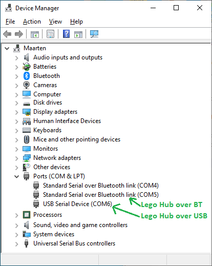
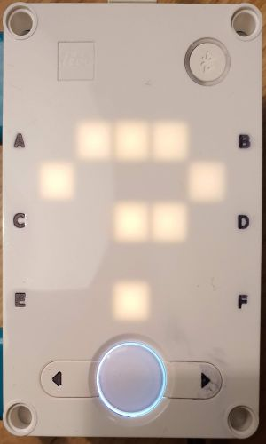
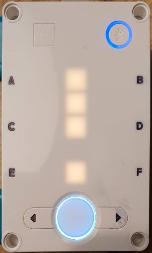
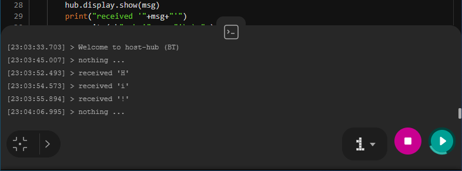

# host-hub

Communication from host to the (Lego Mindstorms 4 Robot Inventor) hub.

## Introduction

The goal is to let a (Python) program on the hub communicate with a program on the host.
As host I am using a PC, but my assumption is that a Mac or Android phone could also be used.

I assume that the host is already Bluetooth paired with the hub.
And I assume that the host is connected to the hub with a USB cable.
We then see three virtual COM ports on the PC:



I do not know what the first one is, but the other two are the serial link over Bluetooth 
and the serial link over USB. These are both known as a _virtual com port_ (VCP).

For development we will use the two links in parallel: the USB serial for uploading and console prints,
the Bluetooth serial for communication the the host.
When development is completed, the USB cable is removed, and the hub just communicates over the 
Bluetooth serial link. This link could be picked up by any application on the host that is able 
to use a serial port.

For my experiments, I used PuTTY top emulate the host application.

## Development

With the hub powered and connected via USB, we start the Lego IDE in Python mode.

This is the communication script that we upload via USB to slot 1.

You can copy-and-paste it, or download and open the [lms file](host-hub.lms).

```python
import hub
import time

# Connect to virtual com port over bluetooth
vcp = hub.BT_VCP(0)
# Show hint on the hub, console and host
hub.display.show( hub.Image("90090:90090:99099:99090:99099") )
print("Welcome to host-hub (BT)")  # Host needs string
vcp.write( b"Send a char\r\n" ) # Host needs bytes
# Last time the wait-for-key hint was shown
prev = time.time()
while True:
    # Listen to port
    now = time.time()
    raw = vcp.readline()
    if raw == None : # There is no message from host
        if now-prev >= 10 : # hint every 10 sec
            # Show hint on the hub, console and host
            hub.display.show("?")
            print("nothing ...")
            vcp.write(b"waiting ...\r\n")
            # Clear hub
            time.sleep(0.2)
            hub.display.show(" ")
            prev = now
    else : # There is a message from the host
        msg= raw.decode("UTF-8") # decode bytes to string
        hub.display.show(msg)
        print("received '"+msg+"'")
        vcp.write( b"ack '"+raw+"'\r\n" )
        prev = now
```

PuTTY runs on COM5, using 115200 as baud rate (optional: Implicit LF in every CR).

Notes
 - This script uses the low-level `hub` module, because high-level `MSHub` module 
   (that the Lego IDE prefers to use) has no support for virtual com ports.
   
 - The time module is used to print a hint when no communication has taken place for 10 seconds.
 
 - The `vcp` (virtual com port) object uses Bluetooth.
   In the [community documentation](https://hubmodule.readthedocs.io/en/latest/VCP/) we 
   also find the `USB_VCP` next to `BT_VCP`. I prefer to use BT for the coms channel
   since that will also allow an Android app instead of a PC app (although Android will
   probably also do serial over USB).
   
 - After the coms channel is available, we "print" a banner over three "channels": to
   the hub 5x5 display (the `Image()` has the letters `bt`), to the console, and over 
   the Bluetooth VCP to the host.
   
   
   
   

   
   
 - Every 10 seconds a hint is printed if no communication has taken place.
   The `prev` records that last time the hint was given.
   
 - Then the main loop starts: an infinite loop that reads data from the host
   and processes it.
   
 - The first capture current time and the bytes transmitted by the host.
   If no bytes were transmitted `raw` is `None` 
   otherwise it is a byte array (not a string!).
 
 - If no bytes are received, nothing happens, except when the last 
   communication was 10 seconds ago. In that case a hint is rendered 
   over all three channels.

   
   
   

   
   
 - The hub display is cleared after 0.2 seconds, so that the next `?` 
   appears visibly.
   
 - If we type `Hi!`, this message is rendered over all three channels

   
   
   

   
 
  - The acknowledge to the host sends a byte array, not a string!

## Standalone

The next step is to run the program standalone.

We decouple the USB cable, close the IDE, power cycle the hub and start PuTTY on COM5.

On the hub, I select slot 1 (by pressing right and the center button).

```text
MicroPython v1.12-1529-gee25066ba on 2021-04-26; LEGO Technic Large Hub with STM32F413xx

Type "help()" for more information.

>>> {"m":0,"p":[[0, [0]], [0, [0]], [0, [0]], [0, [0]], [0, [0]], [0, [0]], [-174, 1, 999], [0, 0, 0], [0, 0, 9], "", 0]}
{"m":0,"p":[[0, [0]], [0, [0]], [0, [0]], [0, [0]], [0, [0]], [0, [0]], [-174, 15, 1003], [0, 0, 0], [0, 0, 9], "", 0]}
...
{"m":0,"p":[[0, [0]], [0, [0]], [0, [0]], [0, [0]], [0, [0]], [0, [0]], [-174, 10, 1001], [0, 0, 0], [0, 0, 9], "", 0]}
{"m":3,"p":["right", 0]}
{"m":0,"p":[[0, [0]], [0, [0]], [0, [0]], [0, [0]], [0, [0]], [0, [0]], [-237, 25, 989], [0, 0, 0], [0, 0, 10], "", 0]}
{"m":2,"p":[8.386, 100, true]}
{"m":0,"p":[[0, [0]], [0, [0]], [0, [0]], [0, [0]], [0, [0]], [0, [0]], [-175, 6, 999], [0, 0, 0], [0, 0, 9], "", 0]}
...
{"m":0,"p":[[0, [0]], [0, [0]], [0, [0]], [0, [0]], [0, [0]], [0, [0]], [-176, 8, 999], [0, 0, 0], [0, 0, 9], "", 0]}
{"m":3,"p":["right", 210]}
{"m":0,"p":[[0, [0]], [0, [0]], [0, [0]], [0, [0]], [0, [0]], [0, [0]], [-156, 12, 999], [0, 0, 3], [0, 0, 9], "", 0]}
...
{"m":0,"p":[[0, [0]], [0, [0]], [0, [0]], [0, [0]], [0, [0]], [0, [0]], [-174, 11, 997], [0, 0, 0], [0, 0, 9], "", 0]}
{"m":2,"p":[8.384, 100, true]}
{"m":0,"p":[[0, [0]], [0, [0]], [0, [0]], [0, [0]], [0, [0]], [0, [0]], [-175, 10, 998], [0, 0, 0], [0, 0, 9], "", 0]}
...
{"m":0,"p":[[0, [0]], [0, [0]], [0, [0]], [0, [0]], [0, [0]], [0, [0]], [-178, 11, 1002], [0, 0, 0], [0, 0, 9], "", 0]}
{"m":3,"p":["right", 0]}
{"m":0,"p":[[0, [0]], [0, [0]], [0, [0]], [0, [0]], [0, [0]], [0, [0]], [-170, 12, 999], [0, 0, 0], [0, 0, 9], "", 0]}
..
{"m":0,"p":[[0, [0]], [0, [0]], [0, [0]], [0, [0]], [0, [0]], [0, [0]], [-173, 9, 999], [0, 0, 0], [0, 0, 9], "", 0]}
{"m":3,"p":["right", 220]}
{"m":0,"p":[[0, [0]], [0, [0]], [0, [0]], [0, [0]], [0, [0]], [0, [0]], [-149, -21, 1004], [0, 0, 0], [0, 0, 9], "", 0]}
...
{"m":0,"p":[[0, [0]], [0, [0]], [0, [0]], [0, [0]], [0, [0]], [0, [0]], [-170, 14, 1000], [0, 0, 0], [0, 0, 9], "", 0]}
{"m":2,"p":[8.386, 100, true]}
{"m":0,"p":[[0, [0]], [0, [0]], [0, [0]], [0, [0]], [0, [0]], [0, [0]], [-174, 9, 998], [0, 0, 0], [0, 0, 9], "", 0]}
{"m":0,"p":[[0, [0]], [0, [0]], [0, [0]], [0, [0]], [0, [0]], [0, [0]], [-260, 84, 985], [1, 0, -7], [0, 0, 10], "", 0]}
{"m":0,"p":[[0, [0]], [0, [0]], [0, [0]], [0, [0]], [0, [0]], [0, [0]], [-166, 1, 1003], [1, 0, 0], [0, 0, 9], "", 0]}
{"m":3,"p":["center", 0]}
{"m":0,"p":[[0, [0]], [0, [0]], [0, [0]], [0, [0]], [0, [0]], [0, [0]], [-176, 10, 1001], [0, 0, 0], [0, 0, 9], "", 0]}
...
{"m":0,"p":[[0, [0]], [0, [0]], [0, [0]], [0, [0]], [0, [0]], [0, [0]], [-145, 0, 980], [-2, 1, 0], [1, 0, 9], "", 0]}
{"m":3,"p":["center", 200]}
{"m":0,"p":[[0, [0]], [0, [0]], [0, [0]], [0, [0]], [0, [0]], [0, [0]], [-172, 5, 999], [0, 0, 0], [1, 0, 9], "", 0]}
...
{"m":0,"p":[[0, [0]], [0, [0]], [0, [0]], [0, [0]], [0, [0]], [0, [0]], [-175, 10, 999], [0, 0, 0], [1, 0, 9], "", 0]}
{"m":2,"p":[8.393, 100, true]}
{"m":0,"p":[[0, [0]], [0, [0]], [0, [0]], [0, [0]], [0, [0]], [0, [0]], [-174, 9, 999], [0, 0, 0], [1, 0, 9], "", 0]}
...
{"m":0,"p":[[0, [0]], [0, [0]], [0, [0]], [0, [0]], [0, [0]], [0, [0]], [-172, 9, 999], [0, 0, 0], [1, 0, 9], "", 0]}
{"m":12,"p":["6sxJkjVKg6-F", true]}
{"m":0,"p":[[0, [0]], [0, [0]], [0, [0]], [0, [0]], [0, [0]], [0, [0]], [-174, 10, 1000], [0, 0, 0], [1, 0, 9], "", 0]}
{"m":"userProgram.print","p":{"value": "V2VsY29tZSB0byBob3N0LWh1YiAoQlQpCg==\n"},"i":2054}
{"m":0,"p":[[0, [0]], [0, [0]], [0, [0]], [0, [0]], [0, [0]], [0, [0]], [-173, 11, 999], [0, 0, 0], [1, 0, 9], "", 0]}
...
{"m":0,"p":[[0, [0]], [0, [0]], [0, [0]], [0, [0]], [0, [0]], [0, [0]], [-174, 7, 1002], [0, 0, 0], [1, 0, 9], "", 0]}
Send a char
...
{"m":0,"p":[[0, [0]], [0, [0]], [0, [0]], [0, [0]], [0, [0]], [0, [0]], [-172, 9, 996], [0, 0, 0], [1, 0, 9], "", 0]}
{"m":2,"p":[8.374, 100, true]}
{"m":0,"p":[[0, [0]], [0, [0]], [0, [0]], [0, [0]], [0, [0]], [0, [0]], [-174, 11, 999], [0, 0, 0], [1, 0, 9], "", 0]}
...
{"m":0,"p":[[0, [0]], [0, [0]], [0, [0]], [0, [0]], [0, [0]], [0, [0]], [-175, 8, 999], [0, 0, 0], [1, 0, 9], "", 0]}
{"m":2,"p":[8.369, 100, true]}
{"m":0,"p":[[0, [0]], [0, [0]], [0, [0]], [0, [0]], [0, [0]], [0, [0]], [-172, 8, 999], [0, 0, 0], [1, 0, 9], "", 0]}
...
{"m":0,"p":[[0, [0]], [0, [0]], [0, [0]], [0, [0]], [0, [0]], [0, [0]], [-171, 8, 999], [0, 0, 0], [1, 0, 9], "", 0]}
{"m":2,"p":[8.369, 100, true]}
{"m":0,"p":[[0, [0]], [0, [0]], [0, [0]], [0, [0]], [0, [0]], [0, [0]], [-172, 10, 1000], [0, 0, 0], [1, 0, 9], "", 0]}
...
{"m":0,"p":[[0, [0]], [0, [0]], [0, [0]], [0, [0]], [0, [0]], [0, [0]], [-175, 9, 1001], [0, 0, 0], [1, 0, 10], "", 0]}
{"m":2,"p":[8.393, 100, true]}
{"m":0,"p":[[0, [0]], [0, [0]], [0, [0]], [0, [0]], [0, [0]], [0, [0]], [-174, 6, 1000], [0, 0, 0], [1, 0, 9], "", 0]}
...
{"m":0,"p":[[0, [0]], [0, [0]], [0, [0]], [0, [0]], [0, [0]], [0, [0]], [-171, 9, 1000], [0, 0, 0], [1, 0, 9], "", 0]}
{"m":"userProgram.print","p":{"value": "cmVjZWl2ZWQgJ0hpIScK\n"},"i":22622}
{"m":0,"p":[[0, [0]], [0, [0]], [0, [0]], [0, [0]], [0, [0]], [0, [0]], [-172, 8, 999], [0, 0, 0], [1, 0, 9], "", 0]}
...
{"m":0,"p":[[0, [0]], [0, [0]], [0, [0]], [0, [0]], [0, [0]], [0, [0]], [-174, 8, 999], [0, 0, 0], [1, 0, 9], "", 0]}
ack 'Hi!'
...
{"m":0,"p":[[0, [0]], [0, [0]], [0, [0]], [0, [0]], [0, [0]], [0, [0]], [-173, 8, 1001], [0, 0, 0], [1, 0, 9], "", 0]}
{"m":0,"p":[[0, [0]], [0, [0]], [0, [0]], [0, [0]], [0, [0]], [0, [0]], [-173, 8, 1000], [0, 0, 0], [1, 0, 9], "", 0]}
```

Notes
 - It seems that the console and the host data is now merged.
 - The console link is actually part of the IDE stream; all the lines of the for `{"m":...}`, where the number
   after the "m" probably denotes the message type.
 - We see a message `"m":"userProgram.print"` with data `V2VsY29tZSB0byBob3N0LWh1YiAoQlQpCg==`.
   This is [Base64](https://www.base64decode.org/) encoding for `Welcome to host-hub (BT)`
 - Similarly `cmVjZWl2ZWQgJ0hpIScK` is the encoding for `received 'Hi!'`.
 - Note that the `Send a char` and the `ack 'Hi!'` are also received.
 
(end)
