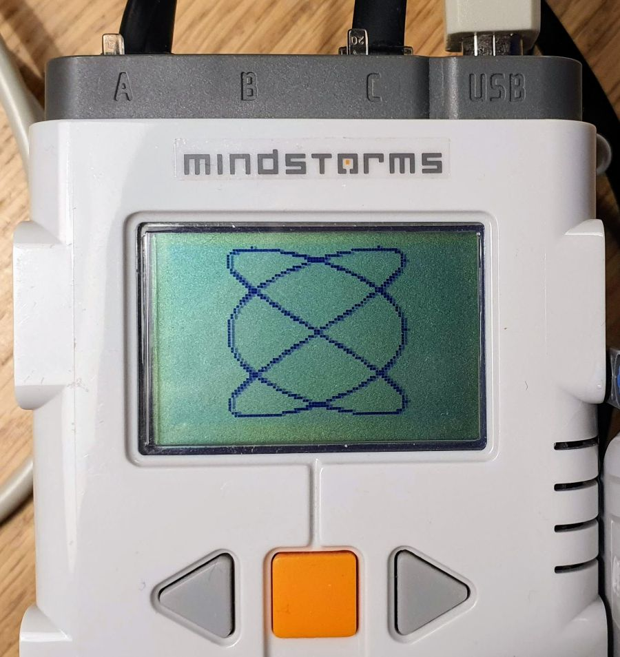
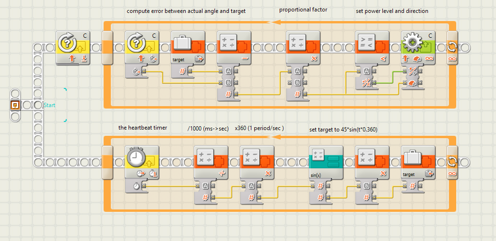

# Lego NXT

Hints, tips, and tricks for MyBlocks in the LEGO NXT Mindstorms robotics system.

## Introduction

NXT-G is the IDE (integrated development environment).
It comes with several "blocks" (subroutines, library functions).
But you can also make your own.

## Native blocks

Never tried it, but it seems you can make your own native block 
using [labview](ftp://ftp.ni.com/evaluation/mindstorms/NXT_Creating_MINDSTORMS_Blocks.pdf).

## Standard blocks

Some blocks are installed but are not enabled by default in the IDE.

### Integer math

NXT 1.0 uses integer math, but NXT 2.0 uses floating point. However the _Integer Math_ block is also installed but not published in the LEGO IDE.
To add the Integer Math Block, create an empty file `Numeric Operations.txt` in the `Data` directory in

`C:\Program Files (x86)\LEGO Software\LEGO MINDSTORMS NXT\engine\EditorVIs\BlockRegistry\`**`Data\Numeric Operations.txt`**

After restarting the IDE, you find a math block with an exclamation mark.

You might wonder why you would want integer math. For one thing: it allows to compute `div` and `mod` (see next section).

By the way, all installed blocks can be found here `C:\Program Files (x86)\LEGO Software\LEGO MINDSTORMS NXT\engine\vi.lib\LEGO\Blocks`.

Found this tip [here](http://linearactuator.blogspot.com/2009/08/interger-blocks-in-nxt-g-20.html).

As an alternative, just copy [../install/engine_EditorVIs_BlockRegistry](../install/engine_EditorVIs_BlockRegistry).

## My Blocks

You can also make your own blocks.
This can be done in the IDE, but you can also copy them from other developers.

On my PC, the My Blocks are stored here
`C:\Users\maarten\Documents\LEGO Creations\MINDSTORMS Projects\Profiles\Default\Blocks\My Blocks`.

### Div and mod

One of the math operations I'm missing is `mod`. So I made my own My Block called `divmod`: 
it computes the mod and the div: 21 div 4 = 5 and 21 mod 4 = 1.

This My Block uses the Integer Math block above, as can be seen in the diagram below.

Download the [divmod.rbt](divmod.rbt) My Block.

### Sinus (half period)

For fancy "rocking" motor movement, a sinus is useful. Unlike EV3, NXT-G doesn't provide that function.
The indian mathematician Bhaskara 1 devised a relatively simple 
[formula](https://en.wikipedia.org/wiki/Bhaskara_I%27s_sine_approximation_formula) to approximate 
the first half period of the sinus function. I named it `sin1h(x)`.

This formula is accurate to about 0.2% in the range 0<=x<=180, when compared to the real `sin(x)`.

|   x  | sin1h(x) |  sin(x) |  error |
|-----:|---------:|--------:|-------:|
|   0  |   0.000  |  0.000  |  0.000 |
|   5  |   0.088  |  0.087  | -0.001 |
|  10  |   0.175  |  0.174  | -0.002 |
|  15  |   0.260  |  0.259  | -0.002 |
|  20  |   0.343  |  0.342  | -0.001 |
|  25  |   0.423  |  0.423  | -0.001 |
|  30  |   0.500  |  0.500  |  0.000 |
|  35  |   0.573  |  0.574  | +0.001 |
|  40  |   0.642  |  0.643  | +0.001 |
|  45  |   0.706  |  0.707  | +0.001 |
|  50  |   0.765  |  0.766  | +0.001 |
|  55  |   0.818  |  0.819  | +0.001 |
|  60  |   0.865  |  0.866  | +0.001 |
|  65  |   0.905  |  0.906  | +0.001 |
|  70  |   0.939  |  0.940  | +0.001 |
|  75  |   0.966  |  0.966  | +0.000 |
|  80  |   0.985  |  0.985  | +0.000 |
|  85  |   0.996  |  0.996  | +0.000 |
|  90  |   1.000  |  1.000  |  0.000 |
|  95  |   0.996  |  0.996  | +0.000 |
| 100  |   0.985  |  0.985  | +0.000 |
| 105  |   0.966  |  0.966  | +0.000 |
| 110  |   0.939  |  0.940  | +0.001 |
| 115  |   0.905  |  0.906  | +0.001 |
| 120  |   0.865  |  0.866  | +0.001 |
| 125  |   0.818  |  0.819  | +0.001 |
| 130  |   0.765  |  0.766  | +0.001 |
| 135  |   0.706  |  0.707  | +0.001 |
| 140  |   0.642  |  0.643  | +0.001 |
| 145  |   0.573  |  0.574  | +0.001 |
| 150  |   0.500  |  0.500  |  0.000 |
| 155  |   0.423  |  0.423  | -0.001 |
| 160  |   0.343  |  0.342  | -0.001 |
| 165  |   0.260  |  0.259  | -0.002 |
| 170  |   0.175  |  0.174  | -0.002 |
| 175  |   0.088  |  0.087  | -0.001 |
| 180  |   0.000  |  0.000  |  0.000 |

I converted this formula to a My Block with the following diagram.

.png)

Download the [sin1h(x).rbt](sin1h(x).rbt) My Block. 
The `1h` suffix indicates this formula only works for 1 half of the period (0..180).

### Sinus (positive angles)

The `sin1h(x)` is only accurate in the range 0..180. To make it periodic, I used the `divmod` from above.

.png)

Download the [sin(x).rbt](sin(x).rbt) My Block.

## Demo applications for My Blocks

### Sinus application: test

To test the sinus, I wrote the following program; it draws
[Lissajous](https://en.wikipedia.org/wiki/Lissajous_curve) figures.

This is an example output

Download the [progs/lissajous.rbt](progs/lissajous.rbt) program.

### Sinus application: motor control

The real application of the sinus block is "swinging" motion, e.g. wind shield wipers, swing, etc.
See [AntonsMindstorms](https://antonsmindstorms.com/2019/01/24/how-to-program-two-synchronised-ev3-motors/) for an explanation.

In a nutshell: there are two tasks. 
One task uses an continuously increasing timer as argument of the sinus function. The result (after multiplying with an amplitude constant) is the target angle of the wiper.
The second task is a P(ID) controller: it computes the error between the actual motor angle and the current target, and uses a proportional control for the power of the motor.

Download the [progs/wiper.rbt](progs/wiper.rbt) program.

### Sinus application: synchronized motors

A key aspect of the timer-target setup, is that a second motor can be incorporated - meaning that the two motors run in sync!

That is demoed by this video of a parent pushing its child on a [swing](https://www.youtube.com/watch?v=0GbMUhZlRqk).

Download the [progs/swing.rbt](progs/swing.rbt) program.

(end)
