# Install 

This page describes installing an _IDE_, an integrated development environment for _RIS_, 
the LEGO Mindstorms Robotics Invention System. The goal is to install the IDE on a modern (2023) PC. 
Recall that RIS came out 25 years earlier, in 1998 (and I write this in 2023).

The first option is to use an Open Source IDE. That is relatively easy, because that still 
runs on modern PCs/OSes.

The second option is to use the original LEGO IDE. That is harder; I used a virtual machine 
for that.

Both require a bit of hardware to hookup the LEGO infra red tower: a DB9 serial connector.

Both require firmware for the RCX. The RCX is the smart brick ("computer") in RIS.

[Introduction](#introduction)

[RCX firmware](#rcx-firmware)

[DB9 connector](#db9-connector)

[Option 1: Open Source IDE](#option-1-open-source-ide)

[Option 2: LEGO IDE](#option-2-lego-ide)


## Introduction

The RCX (smart brick in RIS) contains two memories: ROM and RAM.
The ROM contains a **bootloader**, which starts running when the RCX is powered.
The bootloader checks if there is a valid RAM image - with **(flex) firmware** -
and if so runs that. The flex firmware controls the display and buttons. 
If the user presses the _Run_ button, the flex firmware will run the 
**user application** (there are five slots, and the _Prgm_ button selects 
the slot/application to run). A second press on _Run_ stops the user application.

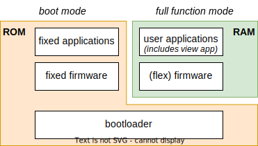

Since the flex firmware (and the user application) are in RAM, removing the 
batteries causes the RAM to lose them (there is a large capacitor inside 
the RCX, so actually you have 60 seconds to replace the batteries without 
losing RAM content). An RCX with empty RAM is known by LEGO as an RCX in _boot mode_. 


We can tell from the display if the RCX is in boot mode: it only shows 
the (running) man and the current slot (1 by default) to the right of the man. 
Once the flex firmware is loaded and the RCX is no longer in boot mode but
in _full function mode_, the display shows powered-on time (hours.minutes, 
begins with 00.00) left of the man.


When the RCX is in boot mode (no flex firmware, no user application), the 
bootloader runs a small **fixed firmware**. This firmware also allows the user to 
select a slot with the _Prgm_ key and run and stop that with the _Run_ key. 
This runs one of the 5 **fixed applications**.

  1. RCX beeps, next motors A and C are powered.
  
  2. Motors A and C are powered. While touch sensor 1 is pressed, A stops, while touch sensor 3 is pressed C stops.
  
  3. If light sensor on port 2 sees light, motors A and C are on, if it sees dark, they are off.
  
  4. Motors A and C are on for 3 seconds (robot moves), motor A is reversed for 3 seconds and then reversed again (robot turns ~ 360 degrees), finally both motors are reversed
  for 3 seconds (robot moves back). This is repeated 5 times.

  5. Motors A and C are powered, when touch sensor on port 1 is pressed: reverse for 1 second, turn, and forwards again.
     This is a drive until collision with backing up.

Also, in boot mode
 - The _View_ button is not working.
   I think the view application happens to be the sixth application, with a dedicated button (_View_) 
   to start and stop it. This application comes with the flex firmware. 
   I assume the view apllication is part of the flex firmware 
   and the not fixed firmware, because LEGO can now add other sensors/actuators
   to the eco system, and update the view application to support viewing them.
   
   The _View_ button needs the flex firmware, but also the sensor ports need to be 
   configured in a mode matching the attached senor (a user program could/should do that).
   
 - You can **not** upload user applications in boot mode.
 
 - But you can upload the flex firmware (takes several minutes) in boot mode.

See the [User guide RIS1.5](https://www.lego.com/cdn/product-assets/product.bi.core.pdf/4129418.pdf)
or the [Constructopedia RIS2.0](https://www.lego.com/cdn/product-assets/product.bi.core.pdf/4157492.pdf)
for official LEGO documentation on the RIS, the RCX and the firmware behavior.


## RCX firmware

The (fixed) firmware is a crucial piece of software.
I have an RIS 1.0 (9719) and RIS 1.5 (9747).
They come with CDs which contain firmware files.

I also have an USB-to-IDE-adapter.
It is normally used to connect a bare harddisk to a PC via USB.
But I once rescued a DVD player from an old desktop.
It also has an IDE connector.
So I used the USB-to-IDE-adapter to connect a bare DVD reader to my laptop.


This enabled me to copy the RCX firmware files from the LEGO RIS CDs 
and store a copy [here](firmware). Copies can also be found on the 
[pbricks](https://pbrick.info/rcx-firmware/index.html) site.


## DB9 connector 

There is one problem you likely have to tackle: connecting the LEGO infra red tower 
to your laptop. My IR towers are from mindstorms robotics invention 1.0 and 1.5. 
Both have a DB9 serial connector (male).

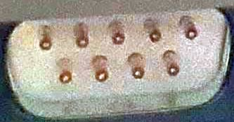

I have no experience with the IR tower in mindstrorms robot invention 2.0.
It has a USB connector. I suspect it comes with a driver, and that driver
is for Windows 98, so useless for modern Windows or Linux.

The mindstrorms robotics invention sets come with a female-to-female serial cable.
I therefore decided to buy a USB-to-serial cable with a DB9 _male_ connector.
This means that my "laptop with the USB-to-serial cable" now has a DB9 male plug,
just like the old PCs, and I can use the LEGO serial cable to connect the IR tower.


Alternatively, you could buy a USB-to-serial _female_ cable, and skip the 
LEGO cable. Not only do I believe my solution is more generic, I also had a
mechanical consideration: I suspect female cables won't fit in the IR tower 
due to the side screws that are usually present.

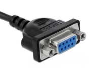

I bought my cable from **ugreen**. The US website no longer lists it, but the 
[Indonesian](https://ugreen.co.id/product/ugreen-usb-to-db9-rs-232-adapter-cable/) or
[Pakistan](https://ugreen.com.pk/product/ugreen-20222-usb-to-db9-rs-232-adapter-cable-2m/)
websites are.
It is available via e.g. amazon. It has a Prolific chip (PL2303) which is plug-and-play
with Windons 10 (so no driver problems). I do have FTDI cables, but not with DB9
connector, and I was also worried about voltage levels. Maybe the ugreen has a 
MAX232 level shifter, anyhow this cable works for me.


## Option 1: Open Source IDE

The easiets way to program the RCX is using open source software.
That still runs on modern PCs/OSes.

My suggested approach is Bricx Command Center [BricxCC](https://bricxcc.sourceforge.net/).
The download [link](https://sourceforge.net/projects/bricxcc/files/bricxcc/)
gives access to latest version (`bricxcc_setup_3389.exe`), which is from 2011-03-15
so I do not expect updates (time of writing January 2023).

I installed BricxCC in `C:\programs\BricxCC` (still afraid of spaces in file paths);
and used "Typical" installation.

I plugged in the USB-to-DB9 cable, connected it with the LEGO serial cable
to the IR tower (which, of course, has a 9V battery), placed the IR tower in front of the RCX
(which, of course, has 6 times an AA battery), switched on the RCX (red _On-Off_ button),
and started BricxCC. The first pop-up is to find the RCX.

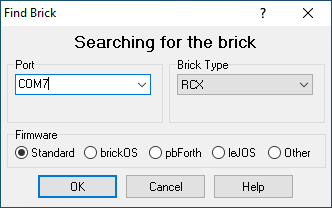

Make sure to select the correct COM port (see Device manager), and press OK.
If you get `No connection to programmable brick`, the USB-to-DB9 cable is not plugged-in 
(or has no driver), or it is not connected to the IR tower. If you get `Cannot find brick`, 
the RCX is not switched on, or not close enough (10cm). If all is fine, the green light in 
the IR tower lights up, confirming that BricxCC was successful in connecting to the tower.

The RCX is now likely in _boot mode_ (see Introduction, the RCX display 
does not show time left of the little man): we just placed batteries, so it contains no
firmware. **Warning:** as a result, most functions (tools) of BrickCC do _not_ work.
Running them typically causes a time-out (about 10sec) - and nothing happens.
It seems that only Tools > Diagnostics > Infrared Power seems to work somehow;
after waiting 10 seconds we can switch it to `Short` (and see the green LED on the tower
switched on for a short period).


Next step is to download the firmware. Select Tools > Download firmware, and browse 
to [`firm0332.lgo`](firm0332-RCX-education/firm0332.lgo). You will see the counter on 
the RCX display to run to 2494 (varies from firmware version to firmware version:
`firm0309.lgo` takes only 1638 steps - [video](https://www.youtube.com/shorts/t8wd-05d9GY)). 
This takes minutes. Note that flashing happens in blocks of 20 steps; I believe if 
such a block fails, it is retried, and finally aborted. This may happen if the distance
between tower and RCX does not match the distance settings (the switch at the bottom 
of the Tower, and configured in RCX, see above) or when there is too much ambient 
IR light (switch off lights in your room, close the curtains, put RCX and tower in a box).


To test if the firmware is downloaded successfully, connect a motor to port A, and 
start Tools > Direct control. Press Motors > A > forward. This should start the motor.


As a final test, we will write a Not Quite C program (NQC).
The default langauge of BricxCC is NXC, but I believe it is for the Lego second 
generation Mindstorms: NXT. So we set NQC as default.
Goto Edit > Preferences then in the Compiler tab and subtab Common check NQC:


First we "build the robot": motor on port C, and touch sensor on port 3.
Secondly, we write a program that will run the motor clock wise or anti clockwise
depending on whether the touch sensor is pressed.

Select File > New, paste this [code](test.nqc) and
save this somewhere with extension `nqc`. The extension supplied with _save_ is
important for the compiler. Only then Compile > Compile.

```C
task main()
{
  SetSensorType(SENSOR_3, SENSOR_TYPE_TOUCH);
  SetSensorMode(SENSOR_3, SENSOR_MODE_BOOL);
  SetPower(OUT_C,1);
  while( 1 )
  {
    if( SensorValue(2) )
      OnFwd(OUT_C);
    else
      OnRev(OUT_C);
  }

}
```

Next select Compile > Download (or press F6 or press the button with the "radio" icon). 
This will upload the compiled program to the slot shown on the ribbon.

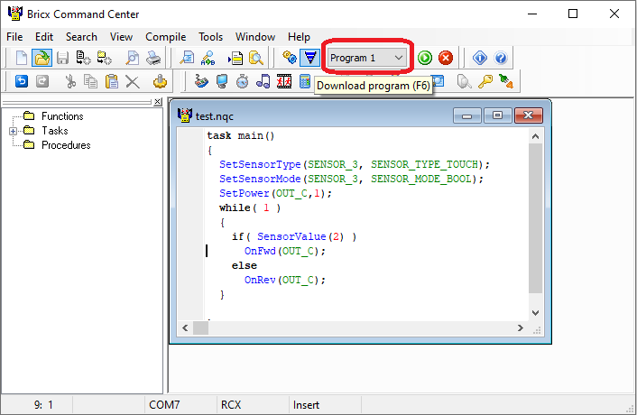

Finally, on the RCX, select slot 1 with the _Prgm_ button and then 
start the uploaded program by pressing the _Run_ button.
The motor attached to port C should start running. A press on the touch
sensor on port 3 should make it run the other way.
Press _Run_ again to stop the program.


## Option 2: LEGO IDE

In this chapter we discuss running the LEGO RIS IDE in a Win98 virtual machine (on a Win10 host).

### Requirements

We need the following parts

 - A virtual machine, we will use VirtualBox, as a so-called hypervisor,
   it is available for [download](https://www.virtualbox.org/).
   
 - A Windows setup disc. I used Win98SE, but probably Win95, Win98 and Windows ME also work.
   It could even be that Windows XP works, especially if you have Robotics Invention System 2.0.
   
   If you have a physical disc you can use it with e.g. an [external DVD drive](#rcx-firmware)
   and mount that in VirtualBox. But I would advise to convert ("rip") it to an ISO file, and later
   mount the ISO file in VirtualBox; easier and faster.
   
   For ripping, I used [infrarecorder](http://infrarecorder.org/).
   I installed it as a "portable application" version (leaves no traces on your harddisc). 
   Sinply press Read Disc to start ripping to an ISO file.
   
   

   Alternatively, you might download an ISO file from the net.
   You never know if you get the real thing, and I wonder about the legal aspects.
   But it is fast and easy. For example, this [article](https://socket3.wordpress.com/2018/10/28/install-configure-windows-98-using-oracle-virtualbox/)
   has an Windows 98 Boot Disk ISO for download .
   
 - A CD from the LEGO mindstorms robotics invention.
 
   Same story as above for the Windows disc: if you have a phsyical disc, you can mount
   a physical DVD drive in the virtual machine, but it is easier to first rip the disc to an ISO
   and later mount the ISO in the virtual machine. I ripped my RIS1.0 disc.
   
   And also here the same story, you might download a LEGO ISO file from the net,
   ignoring safety and legal aspects, for example from [brickfactory](https://www.brickfactory.info/iso/)
   or [mediafire](https://www.mediafire.com/folder/ohsruj4zmjy9g).

### Step 1 - Hypervisor

Download and install as hypervisor [VirtualBox](https://www.virtualbox.org/).

### Step 2 - Create a virtual machine

We create a virtual Windows98SE for our LEGO IDE.
For a background see the [article](https://socket3.wordpress.com/2018/10/28/install-configure-windows-98-using-oracle-virtualbox/).
   
- Select New

   
  
- Fill out the form for _Virtual machine Name_. 

  Use something with "Win98" in the _Name_, and VirtualBox will optimize the virtual machine for Windows 98 
  (see the last line with _Version_).
  Pick a _Folder_ that will store all VM related files (e.g. the virtual harddisk).
  Press _Next_.
  
  
  
- The next screen is for _Hardware_. 
  64M and 1 CPU is typical for a PC with Win98.
  
  
  
- The next screen selects the _Virtual Hard disk_.
  Win98 needs between 100M and 300M bytes on the hard disk. 
  I picked 512MB (pre-allocated), don't overdo; Win98 has FAT, so 2G might cause problems.
  
  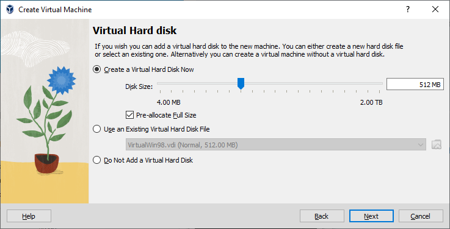

### Step 3 - Install Win98SE

We now have a virtual PC, and we will install Windows 98.

- We mount the Window 98 disc in the secondary IDE drive of the virtual machine.
  
    

  (I had several tries so you might see LegoWin98, V3Win98, Win98RIS, Win98RIS1.0 as VM names)     
  
- Start ("plug in the power") of the virtual machine.

  
 
- Machine of that era could boot from CD. 
  The BIOS of the VM will ask
  if you want to boot from harddisc or CD-ROM, select the latter with the keyboard.
  
  **Warning** if you click the VM window (so that it gets focus for the keyboard input),
  the Win98 virtual machine "locks" your mouse pointer to that window.
  To release the mouse pointer for the host machine (the hypervisor) you must
  press a "secret key". It is listed in the lower right corner, by default it is the _right control key_.

  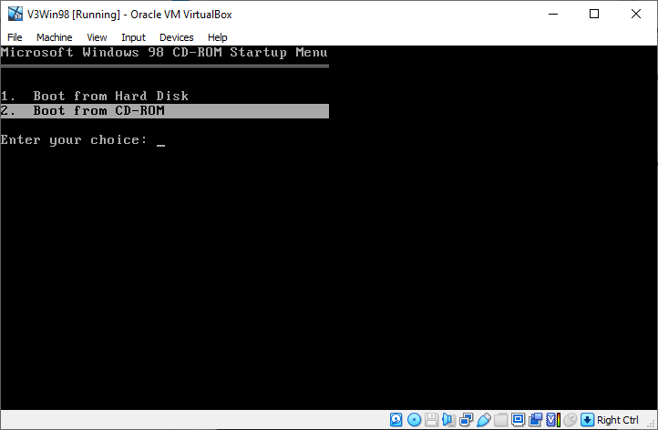

- Software from the CD is loaded, and it pops-up a menu, 
  select "Start Windows 98 Setup from CD-ROM".
  
  

- Windows 98 Setup is now running from CD-ROM. 
  You need to confirm (white letters on blue for windows, no longer white on black for BIOS) 
  that you want to setup since it will wipe the harddisk (the virtual, still empty one in our case).
  So we confirm with ENTER.
  
       

- Windows 98 Setup asks permission to format ("Configure unallocated disk space")
  the (virtual Win98) harddisk.

  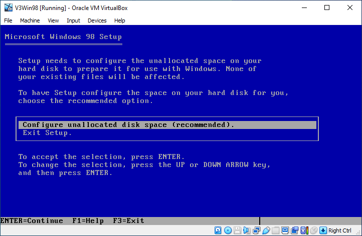   

- Windows 98 Setup has no probably written the master boot record (MBR) of the virtual harddisk.
  That requires a reboot so that the BIOS can register this. We get an information screen for that,
  but it is confusing: it assumes that we have a boot-floppy in A: and a setup cd in D:.
  However, we are more modern, we have a CD from which we boot, and we do not need the A floppy (fortunately).
  Anyhow, this is a clue that, after the reboot, we need to continue from the setup.

     

- We need to continue Windows 98 Setup, so we boot (again) from the CD.

  

- Setup will no probably see the MBR has some markings, and behave differently.
  
  After confirming Windows 98 Setup (again), it will format the harddisk. 
  This is done in a blink of the eye on our virtual machine.

  
  
- Finally we get to the real Setup process.
  There are several screens, this is the first.
  
  

  After (1) Continue, (2) Install on `C:\WINDOWS`, (3) use `Typical`, 
  (4) "Install the most common components", (5) enter some fancy `Computer Description` like `Win98RIS`,
  (6) "Establish your location" (I used United States), and (7) Start Copying Files.
  At the end of copying Setup will reboot. 
  
- This time, boot from **harddisk**, Win98 is installed now.

  (1) Enter some fancy Name and Company, (2) Accept the License Agreement, (3) Enter the License Key,
  and (4) Start Wizard, which will install drivers, and Windows will restart.
  
  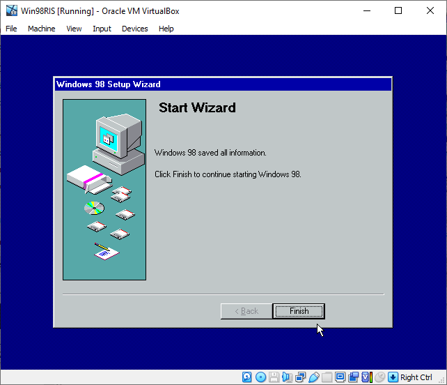
  
- Also now, boot from harddisk, Win98 is installed now.
  Some final driver installs, and then "Windows is now setting up"...
  
  It is probably wise to pick the correct Time Zone.
  
  
  
  And again a restart.
  
- Also now, boot from harddisk (contains Win98).
  I entered an empty password.
  
  
  
- And finally we have windows. We even have sound!

  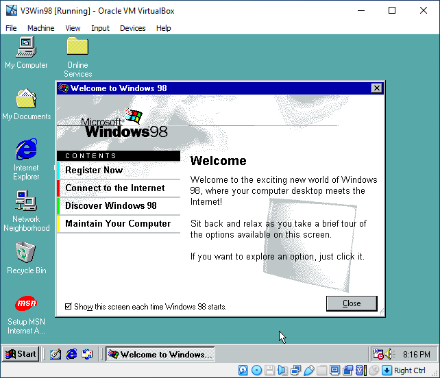
  
  (I would suggest to uncheck this Welcome screen at the bottom left).
 
### Step 4 - COM port

If we open the Device manager on the Win98 machine, we see that we do not have a COM port.
That makes sense, we have to configure the virtual machine to have a COM port.
To do that, we must first shutdown the virtual machine: press Start > Shutdown > OK.

- Make sure the COM port is available on the host machine.
  In my case, I plug in the Prolific USB-to-serial cable.
  And check its COM port assignment.

  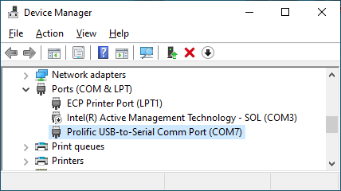
  
  On my machine COM7 is the port we need.

- In VirtualBox manager, select the virtual machine and click Settings and Serial Ports.

  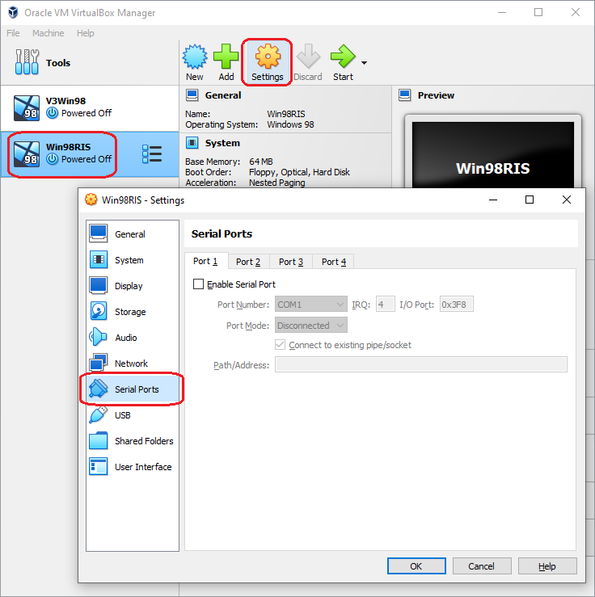

- We need to mount a COM port from the host into the virtual machine.
  The screen confused me quite a lot in the beginning.
  Each of the tabs allows you to mount a port, so at maximum we can mount 4 ports.
  On the tab itself, we select which port of the host to map and how it appears in the virtual machine.
  
  

  Note that we (1) enabled the first port mounting, (2) publish it as COM1 in the Win98 virtual machine,
  (3) configure the "source" as a host device, namely (4) COM7.
  
  The screenshot shows the tool tip help from Virtual box.

- Now we can start the Win98 VM again.
  We need to install a driver for the COM1 port.
  Note that a COM port is _not_ plug and play.
  So the "unknown" devices we find in the Device Manager (with a "?") are not our new COM port.
  
  Via Start > Settings > Control Panel
  
  

  Start Add New Hardware.
  
- On the first page of the Add New Hardware Wizard click Next. Click Next again to start seraching.
  Only the plug&Play devices are found, so we select "No, the device isn't in the list".

  
  
- We let Windows search for the hardware.
  
  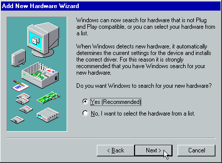

- Windows found the Serial Port (click Details to see).

  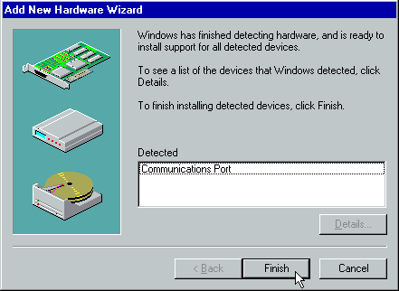
  
- It needs the driver, so browse to `C:\WINDOWS\SYSTEM`.

  

- We open Device manager, for example by right-clicking on My Computer > Properties.
  It confirms we have COM1 driver installed.

  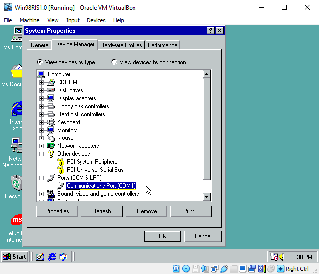
  

### Step 5 - 16 bit colors

If we right-click the Win98 desktop and select Display Properties, tab Settings,
we cannot select the 256 colors mode. That is unfortunate, because the LEGO IDE needs that. 
We need a better driver for the virtual video card.

- Open Device manager, for example by right-clicking on My Computer > Properties

  

- We want to update the video card driver. 
  So in section Display Adapters, select the Standard PCI Graphics Adapter (VGA),
  click Properties > Driver > Update driver, and we get the first page of the driver wizard.
  We click Next.

  
  
- The driver is not on our 


### Step 6 - LEGI IDE


Todo


This article has a driver for "bigger video cards" (VBEMP Universal VESA Video Driver Download).
It also has an Win98 disc, if you don't have your own.

[Alternative](https://www.bartneck.de/2017/06/08/using-your-lego-mindstorms-rcx-on-a-modern-computer/)
(end)
